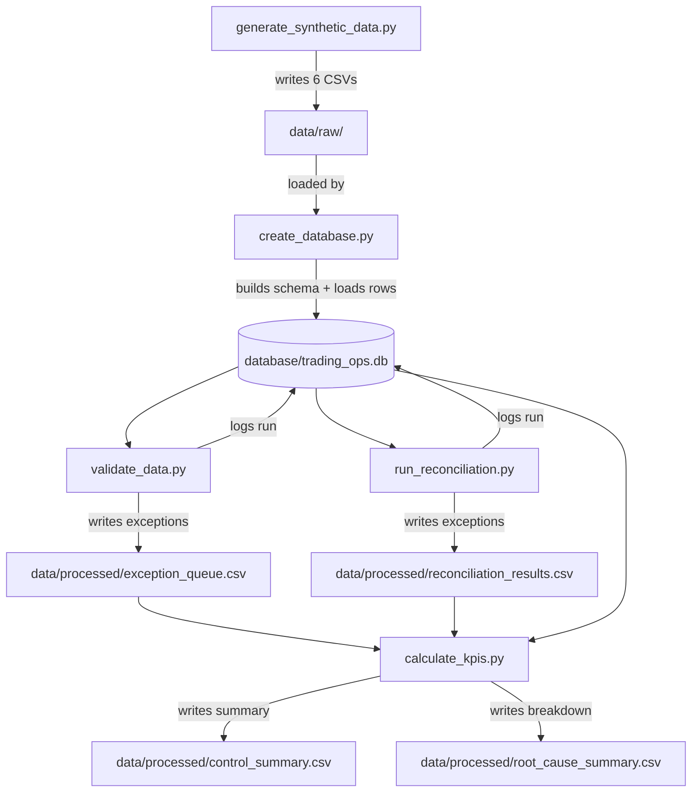

# System Architecture

## Overview

This is a batch-oriented control system: it reads source data, loads it into a central database,
runs a series of control checks against that data, and produces exception and KPI outputs. There
is no live/streaming component — each run represents a single control cycle, similar to a daily
operations check.

## Data Flow Diagram

## Component Responsibilities

| Component | Responsibility |
|-----------|------------------|
| `generate_synthetic_data.py` | Produces reproducible, realistic source data with deliberately embedded data-quality and reconciliation issues. |
| `create_database.py` | Builds the SQLite schema (8 tables) and loads all source CSVs into it. |
| `validate_data.py` | Runs all data quality rules against the loaded data; writes exception records; logs the run. |
| `run_reconciliation.py` | Compares expected vs. processed events and settlement records; writes exception records; logs the run. |
| `calculate_kpis.py` | Aggregates exception and control run data into summary KPIs and a root-cause breakdown. |

## Why SQLite

SQLite was chosen for this prototype because it requires no separate server process, keeps the
whole project self-contained and easy to run on any machine, and is more than sufficient for the
data volumes involved in a demonstration project. A production system at real broker scale would
use a proper RDBMS (e.g. PostgreSQL) or a data warehouse, with the same schema design carrying
over largely unchanged (see `limitations_and_assumptions.md` for more on this).

## Auditability

Every control script logs its execution to the `control_run_log` table — this means every
exception in the system can be traced back to the specific run that generated it, which is a
requirement in any real operational control environment (you need to be able to answer "when did
we first detect this, and has it happened before?").